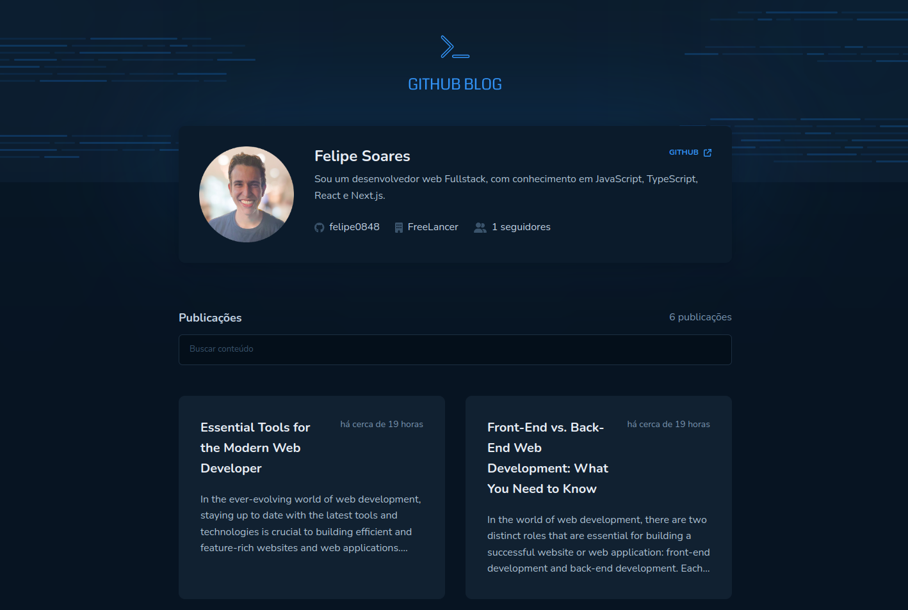
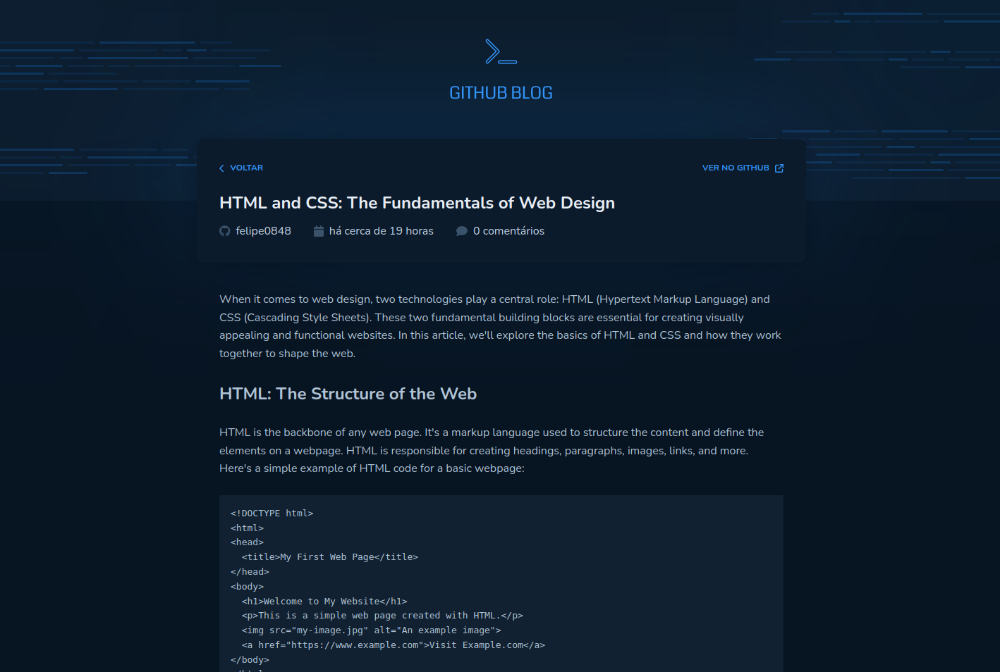

# Projeto GitHub Blog

#### 🚀 Projeto Desenvolvido com Vite e Typescript e styled-components para a estilização.

O desafio era desenvolver uma aplicação que utilizará da API do GitHub para buscar issues de um repositório, dados do seu perfil e exibir elas como um blog, que contenha as seguintes funcionalidades:

-   [x] Listagem do seu perfil com imagem, número de seguidores, nome e outras informações disponíveis pela API do GitHub;
-   [x] Listar e filtrar todas as issues do repositório com um pequeno resumo do conteúdo dela;
-   [x] Criar uma página para exibir um post (issue) completo;

## 🖥️ Pré-requisitos e como rodar a aplicação/testes

Antes de começar, você vai precisar ter instalado em sua máquina as seguintes ferramentas:
[Git](https://git-scm.com)

### 📋 Instruções

-   Clone esse repositório `git clone`
-   Instale as dependências, `npm install`
-   No terminal, digite o comando `npm run dev`

## 🤖 Tecnologias Utilizadas

## 🖼️ Demonstração da aplicação

## 🚧 Status do projeto

Finalizado

Visualização do site:
[Deploy na Vercel](https://github-blog-tau-one.vercel.app/)

## 🧑🏻‍ Autor

Feito por Felipe Soares

